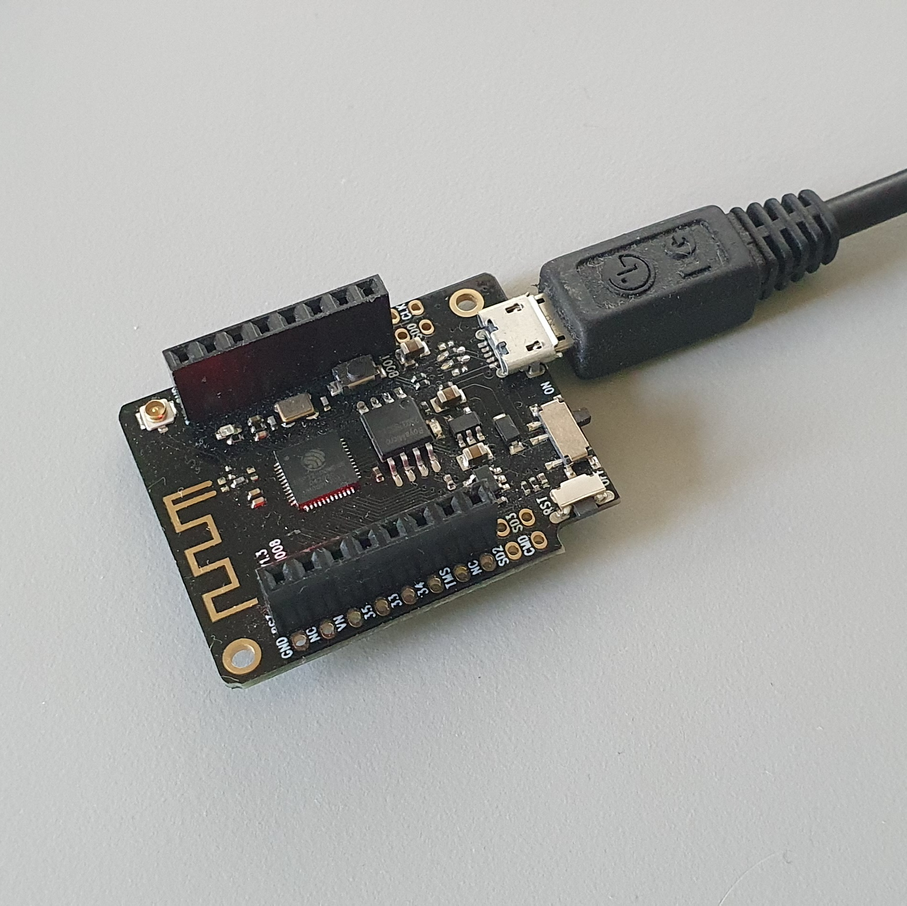

# Testmeetapparaatje

# Over het apparaat

Dit meetapparaatje is bedoeld voor installatietesten en het testen van de stabiliteit van de Twomes dataverzameling; na installatie stuurt het apparaatje elke 10 minuten een 'heartbeat' naar de Twomes server via uw Wi-Fi netwerk thuis.

# Installatie

## 1. Zoek een geschikte plek

Zoek een vrij stopcontact in uw woonkamer dat u enkele weken niet nodig hebt voor iets anders; het liefst een stopcontact dicht bij uw thermostaat.

## 2. Steek de stekker in het stopcontact

Zorg dat het USB-snoer is aangesloten op de USB-stekker (voedingsadapter) en op het apparaatje. Dit kan maar op één manier. Steek de stekker in het stopcontact; u ziet nu lampjes gaan knipperen op het apparaat. *N.B. Er staat géén gevaarlijke spanning op het apparaatje...*

